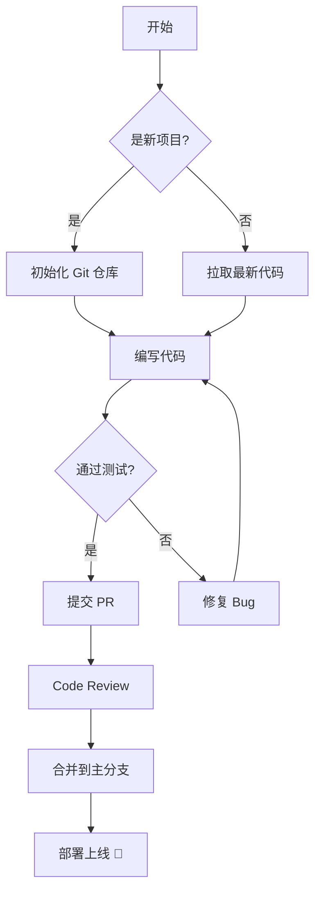
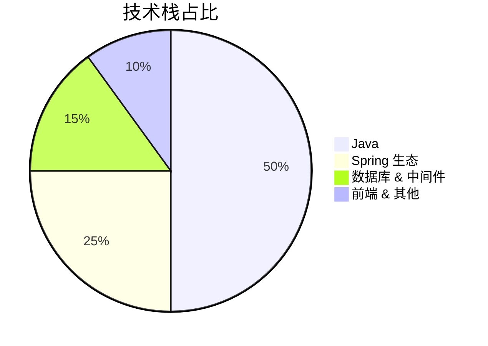

<!-- ====== 头部标题 ====== -->
<h1 align="center">Hey 👋, I'm <a href="https://github.com/ybd0612">Ybond</a></h1>
<h3 align="center">☕ Java Backend Developer | 📍 China</h3>

<p align="center">
  <picture>
    <source media="(prefers-color-scheme: dark)" srcset="https://capsule-render.vercel.app/api?type=waving&color=0:0D1117,50:1F6FEB,100:0D1117&height=150&section=footer" />
    <source media="(prefers-color-scheme: light)" srcset="https://capsule-render.vercel.app/api?type=waving&color=0:FFFFFF,50:1F6FEB,100:FFFFFF&height=150&section=footer" />
    
  </picture>
</p>

<!-- ====== 目录导航 ====== -->
<p align="center">
  <a href="#-关于我">关于我</a> &bull;
  <a href="#-技能栈">技能栈</a> &bull;
  <a href="#-统计面板">统计面板</a> &bull;
  <a href="#-最近活动">最近活动</a> &bull;
  <a href="#-代码片段展示">代码片段</a> &bull;
  <a href="#-mermaid-流程图示例">流程图</a> &bull;
  <a href="#-数学公式示例">数学公式</a> &bull;
  <a href="#-收件箱">收件箱</a>
</p>

---

## 🙋 关于我

> 一个被 Java 选中的后端仔 👨‍💻，日常和 `null` 斗智斗勇。

- 🔭 正在用 **Java** 搭建后端世界——一砖一瓦，全是接口和注解
- 🌱 最近沉迷 **Spring Cloud / 微服务 / 中间件**，感觉头发日渐稀薄
- 👯 热衷研究新技术，看到新框架比看到新番还兴奋
- 💬 关于 **Java / Spring Boot / MySQL / Redis** 的问题尽管来，答不上来算我输（大概）
- 📫 想找我唠嗑？QQ邮箱 [ybd0612@qq.com](mailto:ybd0612@qq.com) | 微信: fwtmde，暗号是 ``Hello World``
- ⚡ 生活真相：一杯茶，一根烟，一个 Bug 改一天。第十天发现少了个分号 ☕

<!-- ====== 折叠块 (details/summary) ====== -->

<details>
<summary>📂 <b>点我看看我的项目坟场（划掉）项目列表</b></summary>

<br>

| 项目 | 说明 | 状态 |
|:---:|:---:|:---:|
| 工作项目 | Java 后端服务，稳定输出中 | ✅ 已上线 |
| 个人项目 | 造轮子进行时 | 🚧 开发中 |
| AI 应用 | 脑洞已开，代码待补 | 💡 规划中 |

</details>

---

## 🛠 技能栈

### 语言与框架

<!-- ====== shields.io 徽章 ====== -->
<p align="center">
  
  
  
  
  
</p>

### 生产力工具（没它们活不下去）

<p align="center">
  
  
  
  
  
  
  
  
</p>

### ⌨️ 操作指南（这些快捷键你得知道）

| 操作 | Windows/Linux | macOS |
|:---|:---:|:---:|
| 复制 | <kbd>Ctrl</kbd> + <kbd>C</kbd> | <kbd>⌘</kbd> + <kbd>C</kbd> |
| 粘贴 | <kbd>Ctrl</kbd> + <kbd>V</kbd> | <kbd>⌘</kbd> + <kbd>V</kbd> |
| 搜索 | <kbd>Ctrl</kbd> + <kbd>F</kbd> | <kbd>⌘</kbd> + <kbd>F</kbd> |
| 保存 | <kbd>Ctrl</kbd> + <kbd>S</kbd> | <kbd>⌘</kbd> + <kbd>S</kbd> |
| 撤销 | <kbd>Ctrl</kbd> + <kbd>Z</kbd> | <kbd>⌘</kbd> + <kbd>Z</kbd> |

---

## 📊 统计面板

<!-- ====== GitHub Readme Stats ====== -->
<p align="center">
  
  
</p>

<!-- ====== GitHub Streak ====== -->
<p align="center">
  
</p>

<!-- ====== 贡献图 ====== -->
<p align="center">
  
</p>

<!-- ====== Trophies / 成就 ====== -->
<p align="center">
  
</p>

---

## 🔄 最近活动

<!-- ====== 最近提交的仓库 (snake animation / 贪吃蛇) ====== -->
<picture>
  <source media="(prefers-color-scheme: dark)" srcset="https://raw.githubusercontent.com/ybd0612/ybd0612/output/github-snake-dark.svg" />
  <source media="(prefers-color-scheme: light)" srcset="https://raw.githubusercontent.com/ybd0612/ybd0612/output/github-snake.svg" />
  
</picture>

---

## 💻 代码片段展示

### Diff 格式 (增删高亮)

```diff
# GitHub README 支持 diff 语法高亮
- public class OldService {
-     public String process() { return "deprecated"; }
- }
+ public class NewService {
+     public String process() { return "improved!"; }
+ }
```

### Java 代码块

```java
@RestController
@RequestMapping("/api/users")
public class UserController {

    @Autowired
    private UserService userService;

    @GetMapping("/{id}")
    public ResponseEntity<User> getUser(@PathVariable Long id) {
        return ResponseEntity.ok(userService.findById(id));
    }

    @PostMapping
    public ResponseEntity<User> createUser(@Valid @RequestBody UserDTO dto) {
        User user = userService.create(dto);
        return ResponseEntity.status(HttpStatus.CREATED).body(user);
    }
}
```

```java
// Spring Boot 配置示例
@Configuration
public class RedisConfig {

    @Bean
    public RedisTemplate<String, Object> redisTemplate(RedisConnectionFactory factory) {
        RedisTemplate<String, Object> template = new RedisTemplate<>();
        template.setConnectionFactory(factory);
        template.setKeySerializer(new StringRedisSerializer());
        template.setValueSerializer(new GenericJackson2JsonRedisSerializer());
        return template;
    }
}
```

---

## 🔀 Mermaid 流程图示例





---

## 🔢 数学公式示例

> GitHub 支持 KaTeX 数学公式渲染

行内公式：质能方程 $E = mc^2$，欧拉公式 $e^{i\pi} + 1 = 0$

块级公式：

$$
\int_{-\infty}^{\infty} e^{-x^2} dx = \sqrt{\pi}
$$

$$
\sum_{n=1}^{\infty} \frac{1}{n^2} = \frac{\pi^2}{6}
$$

$$
\mathbf{F} = m \cdot \mathbf{a} = m \cdot \frac{d\mathbf{v}}{dt}
$$

---

## ⚠️ Alerts 示例

> [!NOTE]
> 这是一个 **Note** 提示框，适合用来补充说明信息。

> [!TIP]
> 这是一个 **Tip** 提示框，适合用来给出有用的建议。

> [!IMPORTANT]
> 这是一个 **Important** 提示框，适合用来强调关键信息。

> [!WARNING]
> 这是一个 **Warning** 提示框，适合用来提醒潜在风险。

> [!CAUTION]
> 这是一个 **Caution** 提示框，适合用来警告可能导致破坏性后果的操作。

---

## ✅ 任务列表

- [x] 学会使用 Git
- [x] 写出第一个 README
- [x] 学会 Mermaid 画图
- [ ] 精通 Spring Cloud 微服务
- [ ] 贡献一个 1k+ star 的开源项目
- [ ] 构建自己的 SaaS 产品

---

## 🦶 脚注示例

GitHub 的 Markdown 支持脚注功能[^1]，这在技术文档中非常有用[^2]。

[^1]: 脚注可以放在文档的任何位置，引用会自动生成链接。
[^2]: GitHub 使用的 Markdown 引擎是 [github-markdown](https://github.com/github/cmark-gfm)。

---

## 🎵 可折叠的音乐播放器 (HTML 示例)

<details>
<summary>🎶 <b>点击展开我的编码歌单</b></summary>

<br>

| # | 歌曲 | 艺术家 | 适合场景 |
|:---:|:---|:---|:---|
| 1 | Lo-Fi Beats | ChilledCow | 日常编码 |
| 2 | Breathe | Telepopmusik | Debug 时放松 |
| 3 | The Algorithm | Perturbator | 冲刺 Deadline |
| 4 | Coding in the Rain | Various | 夜间独处 |

</details>

---

## 📬 收件箱

<p align="center">
  <a href="mailto:ybd0612@qq.com">
    
  </a>
  <a href="https://github.com/ybd0612">
    
  </a>
  <a href="https://steamcommunity.com/id/yourid">
    
  </a>
</p>

---

<!-- ====== 底部动画波浪 ====== -->
<p align="center">
  <picture>
    <source media="(prefers-color-scheme: dark)" srcset="https://capsule-render.vercel.app/api?type=waving&color=0:0D1117,50:1F6FEB,100:0D1117&height=120&section=footer" />
    <source media="(prefers-color-scheme: light)" srcset="https://capsule-render.vercel.app/api?type=waving&color=0:FFFFFF,50:1F6FEB,100:FFFFFF&height=120&section=footer" />
    
  </picture>
</p>

<p align="center">
  <sub><sup>用 ❤️ 和 ☕ 制作 | Powered by GitHub</sup></sub>
</p>